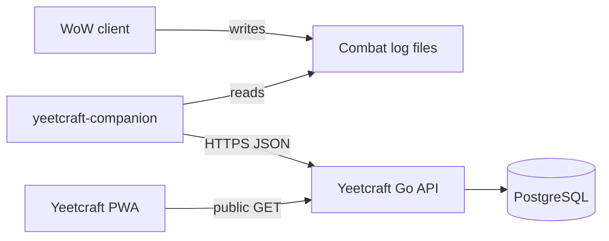

# Yeetcraft integration

> **Status:** Placeholder. No upload client or API contract is implemented in this repository yet.

This document describes how the companion is expected to integrate with [Yeetcraft](https://github.com/Nikolaj-Hvitfeldt/Yeetcraft) at runtime. The **canonical API contract is owned by the Yeetcraft repository**; this file tracks companion-side assumptions and open questions only.

## Architecture (target)

The companion talks **only** to Yeetcraft over HTTP. It does not connect to PostgreSQL, Supabase, or Yeetcraft source code at runtime.

## Development reference vs runtime

| Concern | Development | Runtime |
| ------- | ----------- | ------- |
| Yeetcraft repo | Read-only reference for auth patterns, data model, docs | Not used |
| Yeetcraft API | Spec may be read from Yeetcraft `docs/API.md` | HTTPS only |
| Shared secret | Documented in `.env.example` placeholders | User-provided `YEETCRAFT_API_KEY` |

Opening both repositories in one Cursor workspace is a **developer convenience**. It does not imply a monorepo or shared Go module.

## Authentication (from Yeetcraft — verify before implementing)

**Assumption based on Yeetcraft documentation (not verified by companion code yet):**

- Public **read** endpoints require no API key.
- **Write** / mutation endpoints require a shared secret via `X-API-Key` or `Authorization: Bearer <token>`.
- If the server has no `API_KEY` configured, mutations fail closed (503).

The companion uploader must follow whatever versioned contract Yeetcraft publishes. Do not copy frontend `?token=` query handling — that is a browser UX concern; the companion should use header-based auth.

## API versioning

**TODO**

- [ ] Identify the Yeetcraft API version path or header strategy (e.g. `/api/v1/...`).
- [ ] Document request/response schemas for stat upload in Yeetcraft repo first.
- [ ] Generate or hand-maintain companion client types once the contract is stable.

**Open question:** Will upload reuse `PATCH /api/stats/batch` or a dedicated companion endpoint?

## Data mapping

Yeetcraft’s data model (from Yeetcraft docs — reference only):

| Entity | Companion concern |
| ------ | ----------------- |
| `seasons` | Map current season or accept season ID from API |
| `players` | Match display names from combat log to Yeetcraft player slugs |
| `dungeons` | Map instance/zone from log to canonical dungeon list |
| `player_dungeon_stats` | Deaths and yeets per player × season × dungeon |

**TODO — requires proof**

- [ ] Define slug rules parity with Yeetcraft (`internal/slug` in Yeetcraft backend).
- [ ] Handle unknown players or dungeons (reject vs create — policy TBD in API).
- [ ] Idempotency: avoid double-counting the same M+ run on retry.

## Configuration (planned)

Environment variables (see `.env.example`):

| Variable | Purpose |
| -------- | ------- |
| `YEETCRAFT_API_BASE_URL` | Base URL for API requests |
| `YEETCRAFT_API_KEY` | Write authentication |

No real credentials belong in the repository.

## Error handling (planned)

**TODO**

- [ ] Retry policy for transient network failures.
- [ ] User-visible errors for 401/403 (bad key) vs 503 (server misconfiguration).
- [ ] Queue failed uploads in local storage for later retry.

## Security and privacy

- API keys stay in local `.env` or OS secret storage — never in combat logs or git.
- Upload only user-reviewed aggregates, not raw combat-log files, unless a future API explicitly supports log ingestion (not assumed today).

## Out of scope for this repository

- Implementing new Yeetcraft API routes.
- Changing Yeetcraft authentication middleware.
- Contract generation tooling (may live in Yeetcraft later).

If integration work requires Yeetcraft changes, stop and describe the required Yeetcraft-side task instead of editing that repository from here.
